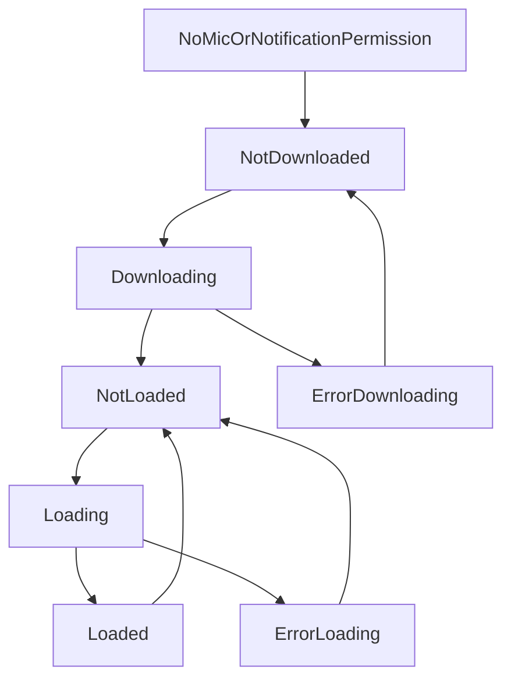
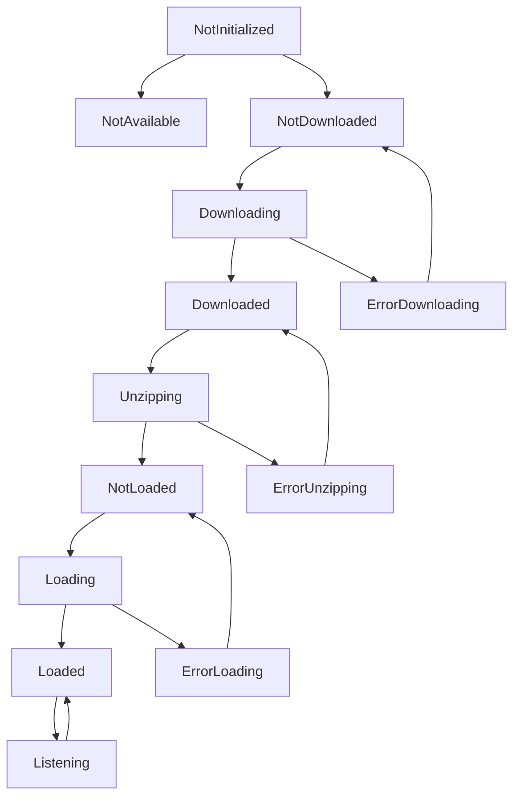
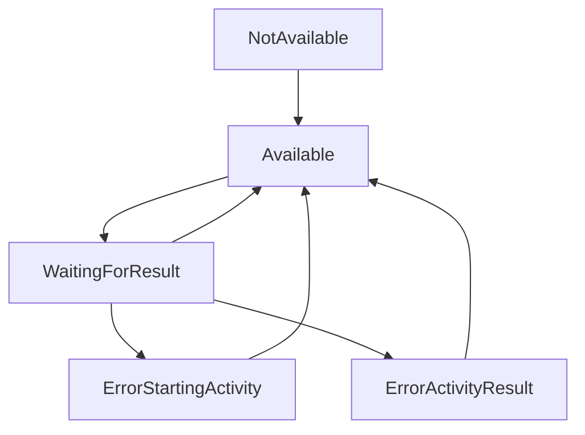

# Dicio Android 项目状态转换机制分析

## 概述

Dicio Android项目采用了基于StateFlow的响应式状态管理架构，通过sealed interface定义状态类型，实现了类型安全的状态转换。本文档详细分析项目中的各种状态管理模式和转换机制。

## 1. 核心状态管理架构

### 1.1 状态管理模式

项目采用以下状态管理模式：
- **Sealed Interface**: 定义有限状态集合
- **StateFlow**: 响应式状态流
- **MutableStateFlow**: 可变状态流
- **状态转换函数**: 封装状态变更逻辑

### 1.2 状态层次结构

```
状态管理层次
├── UI状态 (公开给UI层)
│   ├── WakeState
│   ├── SttState
│   └── InteractionLog
├── 内部状态 (设备实现层)
│   ├── VoskState
│   └── ExternalPopupState
└── 业务状态 (业务逻辑层)
    ├── SkillEvaluator状态
    └── Progress状态
```

## 2. 唤醒词状态管理 (WakeState)

### 2.1 状态定义

```kotlin
sealed interface WakeState {
    data object NoMicOrNotificationPermission : WakeState
    data object NotDownloaded : WakeState
    data class Downloading(val progress: Progress) : WakeState
    data class ErrorDownloading(val throwable: Throwable) : WakeState
    data object NotLoaded : WakeState
    data object Loading : WakeState
    data class ErrorLoading(val throwable: Throwable) : WakeState
    data object Loaded : WakeState
}
```

### 2.2 状态转换图



### 2.3 状态转换逻辑

#### OpenWakeWordDevice中的状态转换

```kotlin
class OpenWakeWordDevice {
    private val _state: MutableStateFlow<WakeState>
    
    init {
        // 初始状态判断
        _state = if (hasModelsAvailable()) {
            MutableStateFlow(WakeState.NotLoaded)
        } else {
            MutableStateFlow(WakeState.NotDownloaded)
        }
    }
    
    override fun download() {
        // NotDownloaded -> Downloading
        _state.value = WakeState.Downloading(Progress.UNKNOWN)
        
        scope.launch {
            try {
                // 下载逻辑...
                // Downloading -> NotLoaded
                _state.value = WakeState.NotLoaded
            } catch (e: Throwable) {
                // Downloading -> ErrorDownloading
                _state.value = WakeState.ErrorDownloading(e)
            }
        }
    }
    
    override fun processFrame(audio16bitPcm: ShortArray): Boolean {
        if (model == null) {
            if (_state.value != WakeState.NotLoaded) {
                throw IOException("Model has not been downloaded yet")
            }
            
            try {
                // NotLoaded -> Loading
                _state.value = WakeState.Loading
                
                // 加载模型...
                model = OwwModel(...)
                
                // Loading -> Loaded
                _state.value = WakeState.Loaded
            } catch (t: Throwable) {
                // Loading -> ErrorLoading
                _state.value = WakeState.ErrorLoading(t)
                throw t
            }
        }
        
        // 处理音频帧...
        return detected
    }
}
```

### 2.4 状态转换触发条件

| 当前状态 | 触发条件 | 目标状态 | 说明 |
|---------|---------|---------|------|
| NoMicOrNotificationPermission | 权限授予 | NotDownloaded | UI层权限检查 |
| NotDownloaded | 调用download() | Downloading | 开始下载模型 |
| Downloading | 下载成功 | NotLoaded | 模型下载完成 |
| Downloading | 下载失败 | ErrorDownloading | 网络或存储错误 |
| NotLoaded | 调用processFrame() | Loading | 首次音频处理 |
| Loading | 模型加载成功 | Loaded | 模型就绪 |
| Loading | 模型加载失败 | ErrorLoading | 模型文件损坏等 |
| Loaded | 模型重置 | NotLoaded | 重新初始化 |

## 3. 语音识别状态管理 (SttState & VoskState)

### 3.1 双层状态设计

项目采用双层状态设计：
- **VoskState**: 内部实现状态，包含实现细节
- **SttState**: UI状态，隐藏实现细节

```kotlin
// 内部状态 (VoskState)
sealed interface VoskState {
    data object NotInitialized : VoskState
    data object NotAvailable : VoskState
    data class NotDownloaded(val modelUrl: String) : VoskState
    data class Downloading(val progress: Progress) : VoskState
    data class ErrorDownloading(val modelUrl: String, val throwable: Throwable) : VoskState
    data object Downloaded : VoskState
    data class Unzipping(val progress: Progress) : VoskState
    data class ErrorUnzipping(val throwable: Throwable) : VoskState
    data object NotLoaded : VoskState
    data class Loading(val thenStartListening: ((InputEvent) -> Unit)?, val shouldEqualAnyLoading: Boolean = false) : VoskState
    data class ErrorLoading(val throwable: Throwable) : VoskState
    data class Loaded(internal val speechService: SpeechService) : VoskState
    data class Listening(internal val speechService: SpeechService, internal val eventListener: (InputEvent) -> Unit) : VoskState
    
    // 状态转换函数
    fun toUiState(): SttState { ... }
}

// UI状态 (SttState)
sealed interface SttState {
    data object NoMicrophonePermission : SttState
    data object NotInitialized : SttState
    data object NotAvailable : SttState
    data object NotDownloaded : SttState
    data class Downloading(val progress: Progress) : SttState
    data class ErrorDownloading(val throwable: Throwable) : SttState
    data object Downloaded : SttState
    data class Unzipping(val progress: Progress) : SttState
    data class ErrorUnzipping(val throwable: Throwable) : SttState
    data object NotLoaded : SttState
    data class Loading(val thenStartListening: Boolean) : SttState
    data class ErrorLoading(val throwable: Throwable) : SttState
    data object Loaded : SttState
    data object Listening : SttState
    data object WaitingForResult : SttState
}
```

### 3.2 Vosk状态转换流程



### 3.3 VoskInputDevice状态转换实现

```kotlin
class VoskInputDevice {
    private val _state = MutableStateFlow<VoskState>(NotInitialized)
    
    override fun download() {
        // NotDownloaded -> Downloading
        _state.value = Downloading(Progress.UNKNOWN)
        
        scope.launch {
            try {
                // 下载模型文件
                downloadBinaryFilesWithPartial(...) { progress ->
                    _state.value = Downloading(progress)
                }
                
                // Downloading -> Downloaded
                // 然后立即开始解压
                unzip()
            } catch (e: Exception) {
                // Downloading -> ErrorDownloading
                _state.value = ErrorDownloading(modelUrl, e)
            }
        }
    }
    
    private suspend fun unzip() {
        // Downloaded -> Unzipping
        _state.value = Unzipping(Progress.UNKNOWN)
        
        try {
            // 解压逻辑...
            withContext(Dispatchers.IO) {
                // 解压进度更新
                _state.value = Unzipping(progress)
            }
            
            // Unzipping -> NotLoaded
            _state.value = NotLoaded
        } catch (e: Exception) {
            // Unzipping -> ErrorUnzipping
            _state.value = ErrorUnzipping(e)
        }
    }
    
    override fun startListening(eventListener: (InputEvent) -> Unit) {
        when (val s = _state.value) {
            is Loaded -> {
                // Loaded -> Listening
                _state.value = Listening(s.speechService, eventListener)
                s.speechService.startListening(...)
            }
            is NotLoaded -> {
                // NotLoaded -> Loading
                _state.value = Loading(eventListener)
                loadModel()
            }
            // 其他状态处理...
        }
    }
    
    private fun loadModel() {
        scope.launch {
            try {
                // Loading状态中...
                val speechService = SpeechService(...)
                
                val state = _state.value
                if (state is Loading) {
                    // Loading -> Loaded
                    _state.value = Loaded(speechService)
                    
                    // 如果需要立即开始监听
                    state.thenStartListening?.let { listener ->
                        startListening(listener)
                    }
                }
            } catch (e: Exception) {
                // Loading -> ErrorLoading
                _state.value = ErrorLoading(e)
            }
        }
    }
}
```

### 3.4 特殊状态处理

#### Loading状态的特殊equals实现

```kotlin
data class Loading(
    val thenStartListening: ((InputEvent) -> Unit)?,
    val shouldEqualAnyLoading: Boolean = false,
) : VoskState {
    override fun equals(other: Any?): Boolean {
        if (other !is Loading) return false
        if (shouldEqualAnyLoading || other.shouldEqualAnyLoading) return true
        return (this.thenStartListening == null) == (other.thenStartListening == null)
    }
    
    override fun hashCode(): Int {
        return if (thenStartListening == null) 0 else 1
    }
}
```

这种特殊实现允许：
- 区分"仅加载"和"加载后立即监听"两种Loading状态
- 支持状态比较的灵活性

## 4. 外部弹窗状态管理 (ExternalPopupState)

### 4.1 状态定义

```kotlin
sealed interface ExternalPopupState {
    data object NotAvailable : ExternalPopupState
    data object Available : ExternalPopupState
    data class WaitingForResult(internal val listener: (InputEvent) -> Unit) : ExternalPopupState
    data class ErrorStartingActivity(val throwable: Throwable) : ExternalPopupState
    data class ErrorActivityResult(val resultCode: Int) : ExternalPopupState
    
    fun toUiState(): SttState { ... }
}
```

### 4.2 状态转换



## 5. 技能评估状态管理 (SkillEvaluator)

### 5.1 交互日志状态

```kotlin
data class InteractionLog(
    val interactions: List<Interaction>,
    val pendingQuestion: PendingQuestion?,
)

data class PendingQuestion(
    val userInput: String,
    val continuesLastInteraction: Boolean,
    val skillBeingEvaluated: String?,
)
```

### 5.2 输入事件处理状态转换

```kotlin
class SkillEvaluatorImpl : SkillEvaluator {
    private val _state = MutableStateFlow(InteractionLog(listOf(), null))
    
    private suspend fun suspendProcessInputEvent(event: InputEvent) {
        when (event) {
            is InputEvent.Error -> {
                // 错误处理，清除待处理问题
                addErrorInteractionFromPending(event.throwable)
            }
            is InputEvent.Final -> {
                // 最终输入，创建待处理问题
                _state.value = _state.value.copy(
                    pendingQuestion = PendingQuestion(
                        userInput = event.utterances[0].first,
                        continuesLastInteraction = skillRanker.hasAnyBatches(),
                        skillBeingEvaluated = null,
                    )
                )
                evaluateMatchingSkill(event.utterances.map { it.first })
            }
            InputEvent.None -> {
                // 无输入，清除待处理问题
                _state.value = _state.value.copy(pendingQuestion = null)
            }
            is InputEvent.Partial -> {
                // 部分输入，更新待处理问题
                _state.value = _state.value.copy(
                    pendingQuestion = PendingQuestion(
                        userInput = event.utterance,
                        continuesLastInteraction = skillRanker.hasAnyBatches(),
                        skillBeingEvaluated = null,
                    )
                )
            }
        }
    }
}
```

## 6. 进度状态管理 (Progress)

### 6.1 进度数据结构

```kotlin
data class Progress(
    val currentCount: Int,    // 当前项目数
    val totalCount: Int,      // 总项目数
    val currentBytes: Long,   // 当前字节数
    val totalBytes: Long,     // 总字节数
) {
    companion object {
        val UNKNOWN = Progress(0, 0, 0, 0)
    }
}
```

### 6.2 进度状态在下载中的应用

```kotlin
// 在下载过程中更新进度
downloadBinaryFilesWithPartial(
    urlsFiles = allModelFiles,
    httpClient = okHttpClient,
    cacheDir = cacheDir,
) { progress ->
    // 更新下载状态
    _state.value = WakeState.Downloading(progress)
}
```

## 7. 状态转换最佳实践

### 7.1 状态设计原则

1. **类型安全**: 使用sealed interface确保状态集合的完整性
2. **不可变性**: 状态对象不可变，通过创建新实例来改变状态
3. **单一职责**: 每个状态只表示一种特定的系统状态
4. **层次分离**: UI状态与实现状态分离

### 7.2 状态转换规则

1. **原子性**: 状态转换应该是原子操作
2. **一致性**: 状态转换后系统应保持一致状态
3. **可预测性**: 相同输入应产生相同的状态转换
4. **错误处理**: 每个可能失败的操作都应有对应的错误状态

### 7.3 调试和监控

```kotlin
// 状态转换日志记录
DebugLogger.logStateMachine(TAG, "State transition: ${oldState} -> ${newState}")

// 状态验证
private fun validateStateTransition(from: WakeState, to: WakeState): Boolean {
    return when (from) {
        is WakeState.NotDownloaded -> to is WakeState.Downloading
        is WakeState.Downloading -> to is WakeState.NotLoaded || to is WakeState.ErrorDownloading
        // 其他转换规则...
        else -> false
    }
}
```

## 8. 状态转换异常处理

### 8.1 异常状态设计

每个可能失败的操作都有对应的错误状态：
- `ErrorDownloading`: 下载失败
- `ErrorLoading`: 加载失败
- `ErrorUnzipping`: 解压失败
- `ErrorStartingActivity`: 活动启动失败

### 8.2 错误恢复机制

```kotlin
// 错误状态的恢复策略
when (val state = _state.value) {
    is WakeState.ErrorDownloading -> {
        // 可以重试下载
        download()
    }
    is WakeState.ErrorLoading -> {
        // 重置到NotLoaded状态
        _state.value = WakeState.NotLoaded
    }
}
```

## 9. 性能优化

### 9.1 状态更新优化

```kotlin
// 避免不必要的状态更新
if (_state.value != newState) {
    _state.value = newState
}

// 批量状态更新
_state.value = _state.value.copy(
    interactions = newInteractions,
    pendingQuestion = newPendingQuestion
)
```

### 9.2 内存管理

```kotlin
// 及时释放资源
when (val state = _state.value) {
    is VoskState.Loaded -> {
        state.speechService.shutdown()
    }
    is VoskState.Listening -> {
        state.speechService.stop()
        state.speechService.shutdown()
    }
}
```

## 10. 总结

Dicio Android项目的状态管理系统具有以下特点：

### 10.1 优势
- **类型安全**: sealed interface确保编译时状态完整性
- **响应式**: StateFlow提供响应式状态更新
- **分层设计**: UI状态与实现状态分离
- **错误处理**: 完善的错误状态和恢复机制

### 10.2 设计模式
- **状态机模式**: 明确的状态转换规则
- **观察者模式**: StateFlow的响应式更新
- **策略模式**: 不同状态下的不同行为

### 10.3 扩展性
- 新增状态类型容易
- 状态转换逻辑清晰
- 便于测试和调试

这种状态管理架构为Dicio项目提供了稳定、可维护的基础，支持复杂的语音交互功能。
