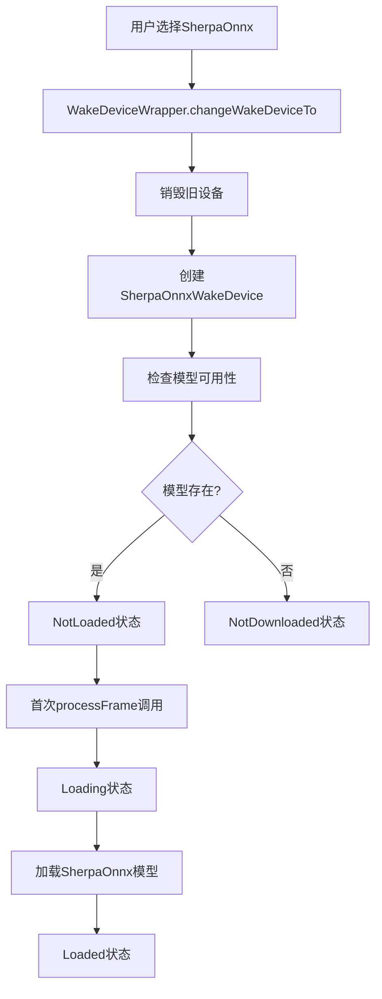
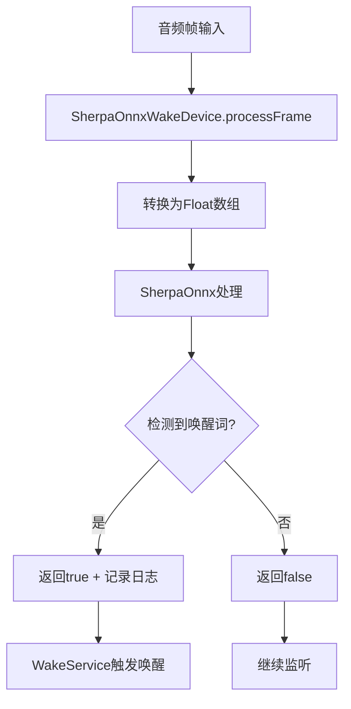

# Dicio 多唤醒技术集成指南

## 概述

本文档详细说明了Dicio Android项目中多唤醒技术的集成实现，包括OpenWakeWord和SherpaOnnx KWS的支持。

## 🏗️ 架构设计

### 1. 核心组件

```
多唤醒技术架构
├── WakeDevice (接口)
│   ├── OpenWakeWordDevice (现有)
│   └── SherpaOnnxWakeDevice (新增)
├── WakeDeviceWrapper (工厂)
├── WakeState (状态管理)
└── Settings UI (配置界面)
```

### 2. 状态管理

所有唤醒设备共享相同的状态转换模式：
- `NotDownloaded` → `Downloading` → `NotLoaded` → `Loading` → `Loaded`
- 错误状态：`ErrorDownloading`、`ErrorLoading`

## 📋 实现清单

### ✅ 已完成的工作

#### 1. **Proto配置更新**
- 📄 `app/src/main/proto/wake_device.proto`
- 添加了 `WAKE_DEVICE_SHERPA_ONNX = 3`

#### 2. **SherpaOnnx设备实现**
- 📄 `app/src/main/kotlin/org/stypox/dicio/io/wake/sherpa/SherpaOnnxWakeDevice.kt`
- 实现了完整的WakeDevice接口
- 支持模型自动复制和加载
- 集成了调试日志系统
- 兼容现有的音频处理流程

#### 3. **工厂模式更新**
- 📄 `app/src/main/kotlin/org/stypox/dicio/di/WakeDeviceWrapper.kt`
- 更新了 `buildInputDevice()` 方法
- 支持动态切换唤醒技术

#### 4. **设置界面集成**
- 📄 `app/src/main/kotlin/org/stypox/dicio/settings/Definitions.kt`
- 📄 `app/src/main/kotlin/org/stypox/dicio/settings/MainSettingsScreen.kt`
- 📄 `app/src/main/res/values/strings.xml`
- 添加了SherpaOnnx选项到唤醒方法设置
- 支持特定技术的配置选项

## 🔧 技术特性

### 1. **统一接口设计**

```kotlin
interface WakeDevice {
    val state: StateFlow<WakeState>
    fun download()
    fun processFrame(audio16bitPcm: ShortArray): Boolean
    fun frameSize(): Int
    fun destroy()
    fun isHeyDicio(): Boolean
}
```

### 2. **智能模型管理**

```kotlin
// 自动检测和复制预打包模型
private fun hasModelsAvailable(): Boolean {
    return hasLocalModels() || hasSherpaModelsInAssets()
}

// 支持assets预打包
private fun copySherpaModelsFromAssets(): Boolean {
    // 从assets复制到内部存储
}
```

### 3. **调试集成**

```kotlin
// 统一的调试日志
DebugLogger.logWakeWord(TAG, "🚀 Initializing SherpaOnnxWakeDevice")
DebugLogger.logWakeWordDetection(TAG, confidence, threshold, detected)

// 音频数据保存
AudioDebugSaver.saveWakeAudio(appContext, audio16bitPcm, amplitude, confidence)
```

## 📱 用户体验

### 1. **设置界面**

用户可以在 `设置 → 输入输出方法 → 唤醒词识别方法` 中选择：
- **OpenWakeWord offline audio processing** (现有)
- **SherpaOnnx KWS (Keyword Spotting)** (新增)
- **Disabled** (禁用)

### 2. **动态切换**

- 切换唤醒技术时自动释放旧资源
- 新技术自动初始化和模型加载
- 保持音频处理的连续性

### 3. **特定配置**

每种技术都有专门的配置选项：
- **OpenWakeWord**: 自定义模型导入/删除
- **SherpaOnnx**: 参数配置和唤醒词管理

## 🔄 状态转换流程

### 1. **初始化流程**



### 2. **运行时流程**



## 🛠️ 开发指南

### 1. **添加新的唤醒技术**

要添加新的唤醒技术，需要：

1. **更新Proto定义**
```proto
enum WakeDevice {
  // ...现有选项
  WAKE_DEVICE_NEW_TECH = 4;
}
```

2. **实现WakeDevice接口**
```kotlin
class NewTechWakeDevice(
    private val appContext: Context
) : WakeDevice {
    // 实现所有必需方法
}
```

3. **更新工厂方法**
```kotlin
private fun buildInputDevice(setting: DataStoreWakeDevice): WakeDevice? {
    return when (setting) {
        // ...现有case
        WAKE_DEVICE_NEW_TECH -> NewTechWakeDevice(appContext)
    }
}
```

4. **添加UI配置**
```kotlin
// 在Definitions.kt中添加选项
// 在MainSettingsScreen.kt中添加特定设置
```

### 2. **模型文件管理**

推荐的模型文件组织结构：
```
app/src/main/assets/models/
├── openWakeWord/
│   ├── melspectrogram.tflite
│   ├── embedding.tflite
│   └── wake.tflite
└── sherpa_kws/
    ├── encoder-epoch-12-avg-2-chunk-16-left-64.onnx
    ├── decoder-epoch-12-avg-2-chunk-16-left-64.onnx
    ├── joiner-epoch-12-avg-2-chunk-16-left-64.onnx
    ├── tokens.txt
    └── keywords.txt
```

### 3. **调试和测试**

使用现有的调试系统：
```kotlin
// 启用调试日志
DebugLogger.logWakeWord(TAG, "调试信息")

// 保存音频数据
AudioDebugSaver.saveWakeAudio(context, audioData, amplitude, confidence)

// 拉取调试数据
./scripts/pull_audio_debug.sh
```

## 🔍 故障排除

### 1. **常见问题**

#### 问题：SherpaOnnx模型未加载
**解决方案**：
1. 检查assets中是否有模型文件
2. 验证文件复制是否成功
3. 查看调试日志确认错误原因

#### 问题：切换唤醒技术后无响应
**解决方案**：
1. 确认WakeService重启
2. 检查音频权限
3. 验证新设备的frameSize()匹配

#### 问题：编译错误
**解决方案**：
1. 运行 `./gradlew clean`
2. 重新生成Proto文件
3. 检查导入语句

### 2. **调试命令**

```bash
# 查看唤醒检测日志
adb logcat | grep "🎯\[.*WakeDevice\]"

# 查看状态转换
adb logcat | grep "🔄.*State"

# 查看模型管理
adb logcat | grep "📦\[.*\]"

# 拉取音频调试数据
./scripts/pull_audio_debug.sh
```

## 📈 性能优化

### 1. **内存管理**

```kotlin
override fun destroy() {
    // 及时释放SherpaOnnx资源
    stream?.release()
    keywordSpotter?.release()
    stream = null
    keywordSpotter = null
}
```

### 2. **音频处理优化**

```kotlin
// 避免不必要的数组转换
private fun processSherpaFrame(audio16bitPcm: ShortArray): Boolean {
    // 只在需要时转换为float
    val audioFloat = FloatArray(audio16bitPcm.size) { i ->
        audio16bitPcm[i].toFloat() / Short.MAX_VALUE
    }
    return processMockSherpaFrame(audioFloat)
}
```

### 3. **状态缓存**

```kotlin
// 缓存模型可用性检查结果
private var modelsAvailabilityCache: Boolean? = null

private fun hasModelsAvailable(): Boolean {
    return modelsAvailabilityCache ?: run {
        val result = hasLocalModels() || hasSherpaModelsInAssets()
        modelsAvailabilityCache = result
        result
    }
}
```

## 🚀 未来扩展

### 1. **计划中的功能**

- [ ] 真实SherpaOnnx库集成
- [ ] 多语言唤醒词支持
- [ ] 自定义唤醒词训练
- [ ] 云端模型下载
- [ ] 性能监控和优化

### 2. **扩展点**

- **新唤醒技术**: 可轻松添加其他KWS引擎
- **模型格式**: 支持更多模型格式
- **配置选项**: 每种技术的专门配置
- **性能调优**: 针对不同设备的优化

## 📚 参考资源

### 1. **相关项目**
- [OpenWakeWord](https://github.com/dscripka/openWakeWord)
- [SherpaOnnx](https://github.com/k2-fsa/sherpa-onnx)
- [HandsFree项目](https://github.com/starry-shivam/HandsFree)

### 2. **技术文档**
- [Dicio架构文档](./01-项目架构总览.md)
- [状态转换分析](./18-状态转换机制分析.md)
- [调试指南](./15-唤醒功能调试指南.md)

## 📝 总结

通过本次集成，Dicio项目现在支持：

1. **多种唤醒技术**: OpenWakeWord + SherpaOnnx KWS
2. **统一架构**: 相同的接口和状态管理
3. **灵活配置**: 用户可自由选择和切换
4. **完整调试**: 统一的日志和音频保存系统
5. **可扩展性**: 易于添加新的唤醒技术

这为Dicio提供了更强的语音唤醒能力和更好的用户体验。
