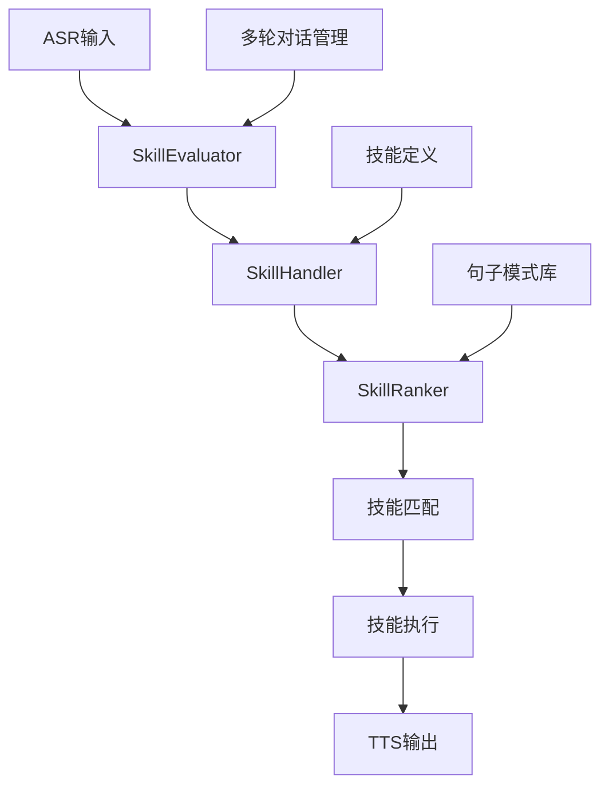
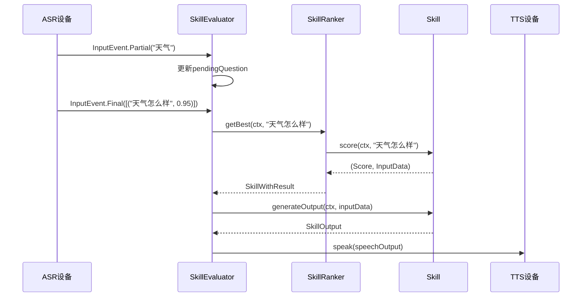
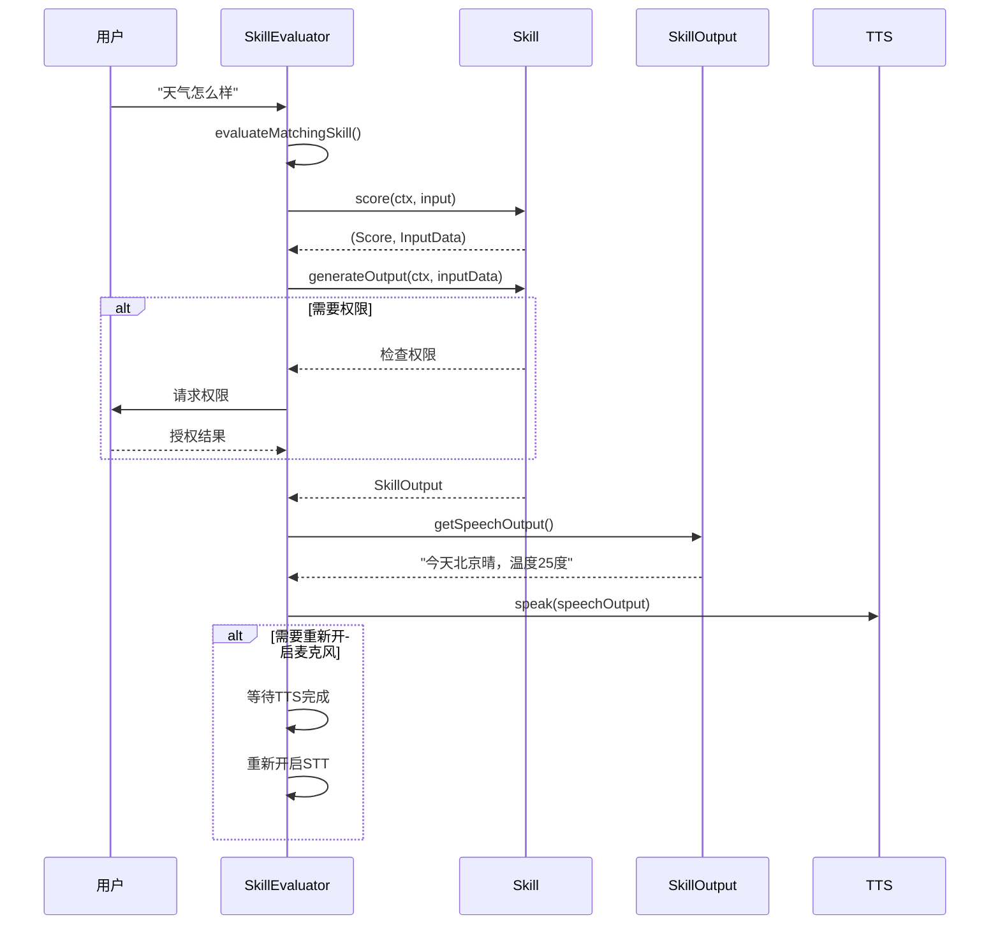

# Dicio语音助手意图分析与命令控制系统设计文档

## 📋 目录
1. [系统概述](#系统概述)
2. [核心架构](#核心架构)
3. [意图识别流程](#意图识别流程)
4. [技能系统](#技能系统)
5. [句子模式匹配](#句子模式匹配)
6. [评分与排序机制](#评分与排序机制)
7. [多轮对话管理](#多轮对话管理)
8. [技能执行流程](#技能执行流程)
9. [扩展与定制](#扩展与定制)
10. [性能优化](#性能优化)

---

## 系统概述

Dicio语音助手采用基于**技能(Skill)**的意图分析和命令控制系统。该系统通过**句子模式匹配**、**评分排序**和**多轮对话管理**来实现精确的语音命令识别和执行。

### 🎯 核心特性
- **多语言支持**: 支持13种语言的句子模式
- **分层评分**: 基于优先级的三轮评分机制
- **多轮对话**: 支持上下文相关的连续交互
- **可扩展架构**: 插件化的技能系统
- **实时处理**: 支持部分识别结果的实时处理

---

## 核心架构

### 🏗️ 主要组件



### 📦 核心类结构

#### 1. SkillEvaluator (技能评估器)
```kotlin
interface SkillEvaluator {
    val state: StateFlow<InteractionLog>
    val inputEvents: SharedFlow<InputEvent>
    var permissionRequester: suspend (List<Permission>) -> Boolean
    fun processInputEvent(event: InputEvent)
}
```

**职责**:
- 处理ASR输入事件 (Partial, Final, Error, None)
- 管理交互状态和对话历史
- 协调技能匹配和执行流程
- 处理权限请求

#### 2. SkillHandler (技能处理器)
```kotlin
@Singleton
class SkillHandler {
    val allSkillInfoList: List<SkillInfo>
    val enabledSkillsInfo: StateFlow<List<SkillInfo>?>
    val skillRanker: StateFlow<SkillRanker>
}
```

**职责**:
- 管理所有可用技能
- 根据用户设置过滤启用的技能
- 创建和维护SkillRanker实例
- 处理技能的生命周期

#### 3. SkillRanker (技能排序器)
```kotlin
class SkillRanker(
    defaultSkillBatch: List<Skill<*>>,
    private var fallbackSkill: Skill<*>
) {
    fun getBest(ctx: SkillContext, input: String): SkillWithResult<*>?
    fun getFallbackSkill(ctx: SkillContext, input: String): SkillWithResult<*>
}
```

**职责**:
- 实现三轮评分机制
- 管理技能优先级 (HIGH, MEDIUM, LOW)
- 处理多轮对话的技能栈
- 提供fallback技能

---

## 意图识别流程

### 🔄 处理流程



### 📝 输入事件类型

#### InputEvent.Partial
```kotlin
// 部分识别结果，用于实时显示
InputEvent.Partial(utterance: String)
```

#### InputEvent.Final  
```kotlin
// 最终识别结果，包含多个候选和置信度
InputEvent.Final(utterances: List<Pair<String, Float>>)
```

#### InputEvent.Error
```kotlin
// 识别错误
InputEvent.Error(throwable: Throwable)
```

#### InputEvent.None
```kotlin
// 无输入或取消
InputEvent.None
```

---

## 技能系统

### 🛠️ 内置技能列表

| 技能ID | 优先级 | 功能描述 | 示例命令 |
|--------|--------|----------|----------|
| weather | HIGH | 天气查询 | "天气怎么样", "北京的天气" |
| current_time | HIGH | 时间查询 | "现在几点", "今天是几号" |
| timer | HIGH | 定时器管理 | "设置5分钟定时器", "取消定时器" |
| media | HIGH | 媒体控制 | "播放音乐", "暂停", "下一首" |
| listening | HIGH | 语音控制 | "停止监听", "开始监听" |
| lyrics | HIGH | 歌词查询 | "周杰伦稻香的歌词" |
| navigation | HIGH | 导航查询 | "去北京大学怎么走" |
| calculator | MEDIUM | 计算器 | "3加5等于多少" |
| open | MEDIUM | 应用启动 | "打开微信", "启动相机" |
| telephone | LOW | 电话拨打 | "给张三打电话" |
| search | LOW | 网络搜索 | "搜索人工智能" |

### 🏗️ 技能定义结构

#### SkillInfo (技能信息)
```kotlin
abstract class SkillInfo(val id: String) {
    abstract fun name(context: Context): String
    abstract fun sentenceExample(context: Context): String
    abstract fun isAvailable(ctx: SkillContext): Boolean
    abstract fun build(ctx: SkillContext): Skill<*>
    
    @Composable
    abstract fun icon(): Painter
    
    open val renderSettings: @Composable () -> Unit = {}
    open val neededPermissions: List<Permission> = listOf()
}
```

#### Skill (技能实现)
```kotlin
abstract class Skill<InputData>(
    val correspondingSkillInfo: SkillInfo,
    val specificity: Specificity
) {
    abstract suspend fun score(ctx: SkillContext, input: String): Pair<Score, InputData>
    abstract suspend fun generateOutput(ctx: SkillContext, inputData: InputData): SkillOutput
}
```

### 📋 技能示例: WeatherSkill

```kotlin
class WeatherSkill(
    correspondingSkillInfo: SkillInfo, 
    data: StandardRecognizerData<Weather>
) : StandardRecognizerSkill<Weather>(correspondingSkillInfo, data) {

    override suspend fun generateOutput(ctx: SkillContext, inputData: Weather): SkillOutput {
        val prefs = ctx.android.weatherDataStore.data.first()
        val city = getCity(prefs, inputData) ?: return WeatherOutput.Failed(city = "")
        
        val weatherData = ConnectionUtils.getPageJson(
            "$WEATHER_API_URL?APPID=$API_KEY&units=metric&lang=" +
            ctx.locale.language.lowercase() + "&q=" + ConnectionUtils.urlEncode(city)
        )
        
        return WeatherOutput.Success(
            city = weatherData.getString("name"),
            description = weatherObject.getString("description"),
            temp = mainObject.getDouble("temp"),
            // ... 其他天气数据
        )
    }
}
```

---

## 句子模式匹配

### 📁 句子定义结构

```
app/src/main/sentences/
├── skill_definitions.yml    # 技能定义和结构
├── cn/                     # 中文句子模式
│   ├── weather.yml
│   ├── calculator.yml
│   └── ...
├── en/                     # 英文句子模式  
│   ├── weather.yml
│   └── ...
└── [其他语言]/
```

### 🔧 技能定义格式

```yaml
# skill_definitions.yml
skills:
  - id: weather
    specificity: high
    sentences:
      - id: current
        captures:
          - id: where
            type: string
```

### 🌍 句子模式示例

#### 中文天气模式 (cn/weather.yml)
```yaml
current:
  - 天气怎么样
  - 天气 怎么样
  - 今天天气如何
  - (.where.)的天气怎么样
  - (.where.) 的 天气 怎么样
  - 外面冷吗
  - 会下雨吗
  - 天气
  - 查询天气
```

#### 英文天气模式 (en/weather.yml)
```yaml
current:
  - (what is|s)|whats the weather like? (in|on .where.)?
  - weather (in|on? .where.)?
  - how is it outside
  - is it cold|cool|warm|hot|sunny|rainy|raining (in|on .where.)|outside?
```

### 🎯 模式匹配特性

#### 1. 参数捕获
- `(.where.)`: 捕获地点参数
- `(.duration.)`: 捕获时间参数
- `(.what.)`: 捕获通用字符串参数

#### 2. 可选匹配
- `(word1|word2)`: 选择匹配
- `word?`: 可选单词
- `(phrase)?`: 可选短语

#### 3. 分词处理
- 支持空格分词: `天气 怎么样`
- 支持连续匹配: `天气怎么样`

---

## 评分与排序机制

### 🏆 三轮评分系统

SkillRanker采用分层评分机制，确保高优先级技能优先匹配：

#### 第一轮: 高优先级技能 (HIGH)
- **阈值**: 0.85
- **策略**: 只考虑HIGH优先级技能
- **目标**: 快速匹配明确的高优先级命令

#### 第二轮: 中等优先级技能 (MEDIUM + HIGH)
- **MEDIUM阈值**: 0.90
- **HIGH阈值**: 0.80 (降低)
- **策略**: 同时考虑MEDIUM和HIGH技能
- **目标**: 在高优先级技能未匹配时，尝试中等优先级

#### 第三轮: 所有技能 (LOW + MEDIUM + HIGH)
- **LOW阈值**: 0.90
- **MEDIUM阈值**: 0.80 (降低)
- **HIGH阈值**: 0.70 (进一步降低)
- **策略**: 考虑所有技能
- **目标**: 最大化匹配可能性

### 📊 评分实现示例

```kotlin
private fun getBest(ctx: SkillContext, input: String): SkillWithResult<*>? {
    Log.d(TAG, "🎯 开始评估输入: '$input'")
    
    // 第一轮: HIGH技能
    val bestHigh = getBestForSpecificity(ctx, highSkills, input)
    if (bestHigh != null && bestHigh.score.scoreIn01Range() > HIGH_THRESHOLD_1) {
        return bestHigh
    }
    
    // 第二轮: MEDIUM + HIGH技能
    val bestMedium = getBestForSpecificity(ctx, mediumSkills, input)
    if (bestMedium != null && bestMedium.score.scoreIn01Range() > MEDIUM_THRESHOLD_2) {
        return bestMedium
    } else if (bestHigh != null && bestHigh.score.scoreIn01Range() > HIGH_THRESHOLD_2) {
        return bestHigh
    }
    
    // 第三轮: 所有技能
    val bestLow = getBestForSpecificity(ctx, lowSkills, input)
    if (bestLow != null && bestLow.score.scoreIn01Range() > LOW_THRESHOLD_3) {
        return bestLow
    } else if (bestMedium != null && bestMedium.score.scoreIn01Range() > MEDIUM_THRESHOLD_3) {
        return bestMedium
    } else if (bestHigh != null && bestHigh.score.scoreIn01Range() > HIGH_THRESHOLD_3) {
        return bestHigh
    }
    
    return null // 使用fallback技能
}
```

---

## 多轮对话管理

### 🔄 对话状态管理

Dicio支持基于技能栈的多轮对话：

#### InteractionPlan (交互计划)
```kotlin
sealed class InteractionPlan {
    object FinishInteraction : InteractionPlan()
    object FinishSubInteraction : InteractionPlan()
    object Continue : InteractionPlan()
    data class StartSubInteraction(val nextSkills: List<Skill<*>>) : InteractionPlan()
    data class ReplaceSubInteraction(val nextSkills: List<Skill<*>>) : InteractionPlan()
}
```

#### 对话流程控制
```kotlin
when (interactionPlan) {
    InteractionPlan.FinishInteraction -> {
        // 结束整个对话，重置到默认技能集
        skillRanker.removeAllBatches()
    }
    is InteractionPlan.FinishSubInteraction -> {
        // 结束子对话，返回上一级
        skillRanker.removeTopBatch()
    }
    is InteractionPlan.Continue -> {
        // 继续当前对话，保持技能栈不变
    }
    is InteractionPlan.StartSubInteraction -> {
        // 开始子对话，推入新的技能集
        skillRanker.addBatchToTop(interactionPlan.nextSkills)
    }
    is InteractionPlan.ReplaceSubInteraction -> {
        // 替换当前子对话
        skillRanker.removeTopBatch()
        skillRanker.addBatchToTop(interactionPlan.nextSkills)
    }
}
```

### 📞 多轮对话示例: 电话技能

```kotlin
// 用户: "给张三打电话"
// 系统: "找到3个张三，请选择：1. 张三(朋友) 2. 张三(同事) 3. 张三(家人)"
// 用户: "第一个"
// 系统: "正在拨打张三(朋友)的电话..."

class TelephoneSkill : Skill<TelephoneData> {
    override suspend fun generateOutput(ctx: SkillContext, inputData: TelephoneData): SkillOutput {
        return when (inputData) {
            is TelephoneData.Dial -> {
                val contacts = findContacts(inputData.who)
                if (contacts.size > 1) {
                    // 返回选择界面，开始子对话
                    ContactChooserOutput(contacts).apply {
                        interactionPlan = InteractionPlan.StartSubInteraction(
                            listOf(ContactChooserSkill(contacts))
                        )
                    }
                } else {
                    // 直接拨打
                    makeCall(contacts.first())
                }
            }
        }
    }
}
```

---

## 技能执行流程

### ⚡ 执行生命周期



### 🔧 技能输出处理

```kotlin
private suspend fun evaluateMatchingSkill(utterances: List<String>) {
    val (chosenInput, chosenSkill) = findBestSkill(utterances)
    
    try {
        // 1. 权限检查
        val permissions = chosenSkill.skill.correspondingSkillInfo.neededPermissions
        if (permissions.isNotEmpty() && !permissionRequester(permissions)) {
            addInteractionFromPending(MissingPermissionsSkillOutput(skillInfo))
            return
        }
        
        // 2. 设置上下文
        skillContext.previousOutput = getLastInteractionOutput()
        
        // 3. 生成输出
        val output = chosenSkill.generateOutput(skillContext)
        val interactionPlan = output.getInteractionPlan(skillContext)
        
        // 4. 添加到交互历史
        addInteractionFromPending(output)
        
        // 5. TTS播放
        output.getSpeechOutput(skillContext).let { speechText ->
            if (speechText.isNotBlank()) {
                skillContext.speechOutputDevice.speak(speechText)
            }
        }
        
        // 6. 处理交互计划
        handleInteractionPlan(interactionPlan)
        
        // 7. 重新开启麦克风 (如果需要)
        if (interactionPlan.reopenMicrophone) {
            skillContext.speechOutputDevice.runWhenFinishedSpeaking {
                sttInputDevice.tryLoad(this::processInputEvent)
            }
        }
        
    } catch (throwable: Throwable) {
        addErrorInteractionFromPending(throwable)
    }
}
```

---

## 扩展与定制

### 🔌 添加新技能

#### 1. 创建技能定义
```kotlin
object CustomSkillInfo : SkillInfo("custom_skill") {
    override fun name(context: Context) = "自定义技能"
    override fun sentenceExample(context: Context) = "执行自定义命令"
    override fun isAvailable(ctx: SkillContext): Boolean = true
    override fun build(ctx: SkillContext): Skill<*> = CustomSkill(this, sentences)
}
```

#### 2. 实现技能逻辑
```kotlin
class CustomSkill(
    correspondingSkillInfo: SkillInfo,
    data: StandardRecognizerData<CustomData>
) : StandardRecognizerSkill<CustomData>(correspondingSkillInfo, data) {

    override suspend fun generateOutput(ctx: SkillContext, inputData: CustomData): SkillOutput {
        return when (inputData) {
            is CustomData.Action -> {
                // 执行自定义逻辑
                performCustomAction(inputData.params)
                CustomSkillOutput.Success("操作完成")
            }
        }
    }
}
```

#### 3. 添加句子模式
```yaml
# skill_definitions.yml
- id: custom_skill
  specificity: medium
  sentences:
    - id: action
      captures:
        - id: params
          type: string
```

```yaml
# cn/custom_skill.yml
action:
  - 执行(.params.)
  - 运行(.params.)
  - 启动(.params.)
```

#### 4. 注册技能
```kotlin
// 在SkillHandler中添加
val allSkillInfoList = listOf(
    WeatherInfo,
    SearchInfo,
    // ... 其他技能
    CustomSkillInfo, // 添加新技能
)
```

### 🌍 添加新语言支持

#### 1. 创建语言目录
```
app/src/main/sentences/
└── [新语言代码]/
    ├── weather.yml
    ├── calculator.yml
    └── ...
```

#### 2. 翻译句子模式
```yaml
# ja/weather.yml (日语示例)
current:
  - 天気はどうですか
  - 今日の天気は
  - (.where.)の天気
  - 外は寒いですか
```

#### 3. 更新本地化资源
```xml
<!-- res/values-ja/strings.xml -->
<string name="skill_name_weather">天気</string>
<string name="skill_sentence_example_weather">天気はどうですか</string>
```

---

## 性能优化

### ⚡ 关键优化策略

#### 1. 句子编译缓存
- 使用KSP编译时生成句子匹配代码
- 避免运行时解析YAML文件
- 预编译正则表达式模式

#### 2. 技能懒加载
```kotlin
class SkillHandler {
    private val skillCache = mutableMapOf<String, Skill<*>>()
    
    private fun buildSkillFromInfo(skillInfo: SkillInfo): Skill<*> {
        return skillCache.getOrPut(skillInfo.id) {
            skillInfo.build(skillContext)
        }
    }
}
```

#### 3. 评分优化
- 三轮评分机制避免不必要的计算
- 早期退出策略
- 技能优先级预排序

#### 4. 内存管理
```kotlin
class SkillRanker : CleanableUp {
    override fun cleanup() {
        batches.clear()
        // 清理缓存和临时数据
    }
}
```

### 📊 性能监控

#### 关键指标
- **技能匹配时间**: < 100ms
- **句子解析时间**: < 50ms  
- **内存使用**: < 50MB (技能系统)
- **技能加载时间**: < 200ms

#### 日志监控
```kotlin
Log.d(TAG, "🎯 开始技能匹配评估，输入语句: $utterances")
Log.d(TAG, "📊 技能数量 - High: ${highSkills.size}, Medium: ${mediumSkills.size}, Low: ${lowSkills.size}")
Log.d(TAG, "🏆 最佳技能: ${bestSkill?.skill?.correspondingSkillInfo?.id} (${bestSkill?.score?.scoreIn01Range()})")
```

---

## 总结

Dicio的意图分析与命令控制系统通过以下核心机制实现了高效、准确的语音命令处理：

### 🎯 核心优势
1. **分层评分**: 确保高优先级命令优先匹配
2. **多语言支持**: 灵活的句子模式定义系统
3. **多轮对话**: 基于技能栈的上下文管理
4. **可扩展性**: 插件化的技能架构
5. **性能优化**: 编译时优化和运行时缓存

### 🔄 处理流程总结
```
ASR输入 → SkillEvaluator → SkillRanker → 技能匹配 → 技能执行 → TTS输出
    ↓           ↓              ↓           ↓           ↓           ↓
 实时显示   状态管理      三轮评分    句子匹配    业务逻辑    语音反馈
```

### 📈 扩展方向
- 支持更多自然语言处理技术
- 集成机器学习模型进行意图分类
- 增强多轮对话的上下文理解能力
- 优化跨语言技能共享机制

这套系统为Dicio提供了强大而灵活的语音命令处理能力，支持从简单的单轮查询到复杂的多轮交互场景。
