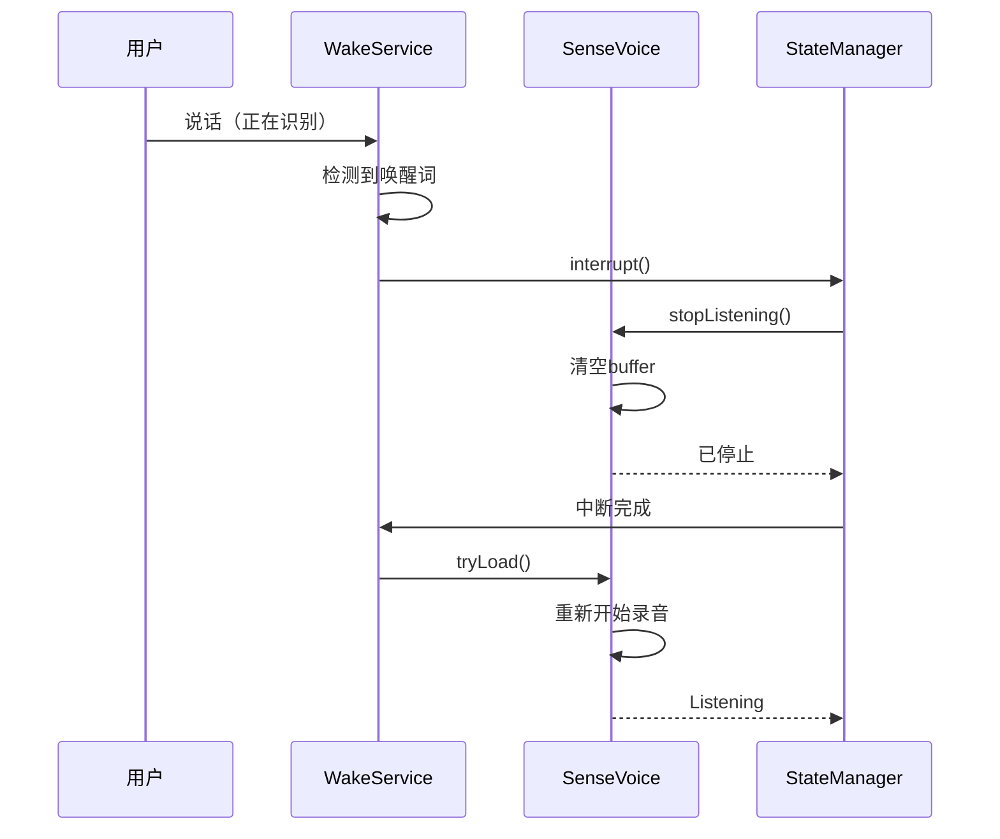

# 语音助手架构重构方案 - 状态管理简化

> 版本: 2.0  
> 日期: 2025-10-14  
> 目标: 简化状态管理，支持随时打断

## 🎯 核心问题分析

### 问题1: 状态重复

**当前架构**：
```kotlin
// 两套状态系统
VoiceAssistantUIState: IDLE, WAKE_DETECTED, LISTENING, PROCESSING, SPEAKING, ERROR
SttState: NotInitialized, NotLoaded, Loading, Loaded, Listening, ...
```

**问题**：
- 状态映射复杂：`SttState.Listening` → `VoiceAssistantUIState.LISTENING`
- 状态不一致风险：两个状态可能不同步
- 代码冗余：StateCoordinator 只做状态转换

### 问题2: StateCoordinator 必要性

**当前职责**：
```kotlin
class VoiceAssistantStateCoordinator {
    // 监听 SttState
    // 转换为 VoiceAssistantUIState
    // 通知 UI 层
}
```

**分析**：
- ✅ 解耦：UI 层不直接依赖 STT 实现
- ❌ 过度设计：只是简单的状态映射
- ❌ 中间层：增加复杂度，难以调试

**结论**: ⚠️ 可以简化，但保留部分职责

### 问题3: 随时打断功能缺失

**需求**：
```
用户说话（ASR识别中）
    ↓
检测到唤醒词
    ↓
中断当前识别
    ↓
清空音频buffer
    ↓
重新开始识别
```

**当前问题**：
- WakeService 和 SenseVoiceInputDevice 的 AudioRecord 冲突
- 没有中断机制
- 没有 buffer 清空逻辑

---

## 📊 参考：VOSK 状态管理

### VOSK 的优秀设计

```kotlin
// 单一状态源
sealed interface VoskState {
    object NotDownloaded : VoskState
    data class Downloading(val progress: Progress) : VoskState
    object NotLoaded : VoskState
    data class Loading(val thenStartListening: Boolean) : VoskState
    object Loaded : VoskState
    object Listening : VoskState
    data class Error(val throwable: Throwable) : VoskState
}

// UI 直接使用 VoskState
when (voskState) {
    is VoskState.Listening -> showListening()
    is VoskState.Loaded -> showReady()
    // ...
}
```

**优点**：
1. ✅ 单一状态源（Single Source of Truth）
2. ✅ 状态完整描述了系统的所有情况
3. ✅ UI 直接映射状态，无中间层
4. ✅ 易于测试和调试

---

## 🏗️ 重构方案

### 方案A: 激进重构（推荐）

#### 1. 统一状态定义

```kotlin
/**
 * 语音助手统一状态
 * 参考 VOSK 设计，合并 SttState 和 VoiceAssistantUIState
 */
sealed interface VoiceAssistantState {
    
    // ========== 初始化阶段 ==========
    /** 未初始化 */
    data object NotInitialized : VoiceAssistantState
    
    /** 正在加载 */
    data class Loading(val progress: Float) : VoiceAssistantState
    
    /** 加载失败 */
    data class LoadingError(val error: Throwable) : VoiceAssistantState
    
    // ========== 运行阶段 ==========
    /** 空闲 - 等待唤醒词 */
    data object Idle : VoiceAssistantState
    
    /** 监听中 - 正在录音识别 */
    data class Listening(
        val startTime: Long,
        val partialText: String = ""
    ) : VoiceAssistantState
    
    /** 处理中 - 执行技能匹配 */
    data class Processing(
        val text: String
    ) : VoiceAssistantState
    
    /** 播报中 - TTS 播放 */
    data class Speaking(
        val text: String
    ) : VoiceAssistantState
    
    // ========== 特殊状态 ==========
    /** 错误 */
    data class Error(
        val error: Throwable,
        val canRecover: Boolean = true
    ) : VoiceAssistantState
    
    /** 被中断 - 检测到新唤醒词 */
    data object Interrupted : VoiceAssistantState
}
```

#### 2. 简化的 StateManager

```kotlin
/**
 * 语音助手状态管理器
 * 职责：
 * 1. 维护统一的状态
 * 2. 处理状态转换逻辑
 * 3. 提供状态查询接口
 * 
 * 不再需要：
 * - VoiceAssistantStateCoordinator（删除）
 * - VoiceAssistantUIState（删除）
 */
@Singleton
class VoiceAssistantStateManager @Inject constructor(
    private val sttInputDevice: SttInputDeviceWrapper,
    private val skillEvaluator: SkillEvaluator,
    private val ttsDevice: SpeechOutputDeviceWrapper
) {
    
    private val _state = MutableStateFlow<VoiceAssistantState>(VoiceAssistantState.NotInitialized)
    val state: StateFlow<VoiceAssistantState> = _state.asStateFlow()
    
    // ========== 状态转换方法 ==========
    
    fun onWakeWordDetected() {
        // 如果正在识别，先中断
        if (_state.value is VoiceAssistantState.Listening) {
            interrupt()
        }
        
        // 开始新的识别
        _state.value = VoiceAssistantState.Listening(
            startTime = System.currentTimeMillis()
        )
    }
    
    fun onPartialResult(text: String) {
        val current = _state.value
        if (current is VoiceAssistantState.Listening) {
            _state.value = current.copy(partialText = text)
        }
    }
    
    fun onFinalResult(text: String) {
        _state.value = VoiceAssistantState.Processing(text)
    }
    
    fun onTtsSpeaking(text: String) {
        _state.value = VoiceAssistantState.Speaking(text)
    }
    
    fun onTtsCompleted() {
        _state.value = VoiceAssistantState.Idle
    }
    
    // ========== 中断机制 ==========
    
    fun interrupt() {
        Log.d(TAG, "🛑 中断当前状态: ${_state.value}")
        
        when (val current = _state.value) {
            is VoiceAssistantState.Listening -> {
                // 停止 STT
                sttInputDevice.stopListening()
                // 清空 buffer（由 SenseVoiceInputDevice 内部处理）
            }
            is VoiceAssistantState.Processing -> {
                // 取消技能处理
                skillEvaluator.cancel()
            }
            is VoiceAssistantState.Speaking -> {
                // 停止 TTS
                ttsDevice.stopSpeaking()
            }
            else -> {
                // 其他状态不需要中断
            }
        }
        
        _state.value = VoiceAssistantState.Interrupted
    }
    
    // ========== 状态查询 ==========
    
    fun canStartListening(): Boolean {
        return _state.value is VoiceAssistantState.Idle ||
               _state.value is VoiceAssistantState.Interrupted
    }
    
    fun isActive(): Boolean {
        return _state.value !is VoiceAssistantState.Idle &&
               _state.value !is VoiceAssistantState.NotInitialized
    }
}
```

#### 3. UI 直接使用状态

```kotlin
// DraggableFloatingOrb.kt
@Composable
fun FloatingOrb(stateManager: VoiceAssistantStateManager) {
    val state by stateManager.state.collectAsState()
    
    when (state) {
        is VoiceAssistantState.Idle -> {
            // 显示空闲动画
            LottieAnimation(animation = "idle.json")
        }
        
        is VoiceAssistantState.Listening -> {
            // 显示监听动画 + 实时文本
            LottieAnimation(animation = "listening.json")
            Text(state.partialText)
        }
        
        is VoiceAssistantState.Processing -> {
            // 显示处理动画
            LottieAnimation(animation = "processing.json")
            Text(state.text)
        }
        
        is VoiceAssistantState.Speaking -> {
            // 显示播报动画 + TTS文本
            LottieAnimation(animation = "speaking.json")
            Text(state.text)
        }
        
        is VoiceAssistantState.Error -> {
            // 显示错误
            ErrorView(state.error)
        }
        
        else -> {
            // Loading 等状态
        }
    }
}
```

#### 4. 随时打断实现

```kotlin
// WakeService.kt
private fun onWakeWordDetected() {
    Log.d(TAG, "🎯 检测到唤醒词")
    
    // 通过 StateManager 处理中断
    stateManager.interrupt()
    
    // 短暂延迟后开始新的识别
    handler.postDelayed({
        stateManager.onWakeWordDetected()
        sttInputDevice.tryLoad(::handleInputEvent)
    }, 100)  // 100ms 缓冲时间
}

// SenseVoiceInputDevice.kt
fun clearBufferAndRestart() {
    Log.d(TAG, "🧹 清空buffer并重启")
    
    // 清空音频buffer
    speechBuffer.clear()
    isSpeechDetected = false
    speechStartTime = 0L
    lastRecognitionTime = 0L
    
    // 重置识别器
    senseVoiceRecognizer?.reset()
    vad?.reset()
    
    // 重新开始录音
    isRecording.set(true)
}
```

---

### 方案B: 渐进式重构（保守）

保留现有架构，只做关键改进：

#### 1. 增强 StateCoordinator

```kotlin
class VoiceAssistantStateCoordinator {
    
    // 新增：中断方法
    fun interrupt() {
        when (_uiState.value) {
            VoiceAssistantUIState.LISTENING -> {
                sttInputDevice.stopListening()
                updateUIState(VoiceAssistantUIState.INTERRUPTED)
            }
            VoiceAssistantUIState.SPEAKING -> {
                speechOutputDevice.stopSpeaking()
                updateUIState(VoiceAssistantUIState.INTERRUPTED)
            }
            else -> {
                // 无需中断
            }
        }
    }
    
    // 新增：从中断恢复
    fun resumeFromInterruption() {
        updateUIState(VoiceAssistantUIState.LISTENING)
    }
}

// 新增状态
enum class VoiceAssistantUIState {
    IDLE,
    LISTENING,
    PROCESSING,
    SPEAKING,
    INTERRUPTED,  // 新增
    ERROR
}
```

#### 2. AudioRecord 资源共享

```kotlin
// 新增：AudioRecord 管理器
object AudioRecordManager {
    private var currentOwner: String? = null
    private var currentRecord: AudioRecord? = null
    
    fun acquire(owner: String, config: AudioConfig): AudioRecord? {
        // 如果有其他owner，先释放
        if (currentOwner != null && currentOwner != owner) {
            release(currentOwner!!)
        }
        
        currentRecord = AudioRecord(...)
        currentOwner = owner
        return currentRecord
    }
    
    fun release(owner: String) {
        if (currentOwner == owner) {
            currentRecord?.stop()
            currentRecord?.release()
            currentRecord = null
            currentOwner = null
        }
    }
}

// WakeService 使用
val audioRecord = AudioRecordManager.acquire("WakeService", config)

// SenseVoiceInputDevice 使用
val audioRecord = AudioRecordManager.acquire("SenseVoice", config)
```

---

## 📈 对比分析

### 方案对比

| 特性 | 方案A（激进） | 方案B（保守） | 当前架构 |
|------|-------------|-------------|---------|
| 状态统一性 | ✅ 单一状态 | ❌ 双状态 | ❌ 双状态 |
| 代码复杂度 | ⭐⭐⭐ | ⭐⭐⭐⭐ | ⭐⭐⭐⭐⭐ |
| 中断支持 | ✅ 内置 | ⚠️ 需额外实现 | ❌ 无 |
| 重构风险 | 🔴 高 | 🟡 中 | 🟢 低 |
| 维护成本 | 🟢 低 | 🟡 中 | 🔴 高 |
| 参考 VOSK | ✅ 相似 | ❌ 不同 | ❌ 不同 |

### 迁移成本

**方案A（激进）**：
- 删除文件：2个（StateCoordinator, VoiceAssistantUIState）
- 修改文件：约15个
- 新增文件：1个（VoiceAssistantStateManager）
- 工作量：2-3天

**方案B（保守）**：
- 删除文件：0个
- 修改文件：约5个
- 新增文件：1个（AudioRecordManager）
- 工作量：1天

---

## 🎯 推荐方案

### 短期（1周内）：方案B

**理由**：
1. 快速解决随时打断问题
2. 风险可控
3. 不影响现有功能

**实施步骤**：
1. 创建 `AudioRecordManager`
2. 在 `StateCoordinator` 添加 `interrupt()`
3. 在 `WakeService` 检测到唤醒词时调用 `interrupt()`
4. 测试中断功能

### 长期（1-2个月）：方案A

**理由**：
1. 架构更清晰
2. 符合 VOSK 最佳实践
3. 易于维护和扩展

**实施步骤**：
1. 创建 `VoiceAssistantState` 定义
2. 实现 `VoiceAssistantStateManager`
3. 逐步迁移 UI 组件
4. 删除旧的 StateCoordinator
5. 全面测试

---

## 💡 随时打断的完整实现

### 核心流程



### 关键代码

#### 1. WakeService 检测逻辑

```kotlin
private fun processAudioFrame(audio: ShortArray) {
    // 检测唤醒词
    val wakeWordDetected = wakeDevice.processFrame(audio)
    
    if (wakeWordDetected) {
        // 检查是否在backoff期间
        val now = Instant.now()
        if (now > nextWakeWordAllowed) {
            nextWakeWordAllowed = now.plusMillis(WAKE_WORD_BACKOFF_MILLIS)
            
            // ✅ 关键：无论当前状态，都执行中断
            onWakeWordDetected()
        }
    }
}

private fun onWakeWordDetected() {
    Log.d(TAG, "🎯 唤醒词检测到")
    
    // 1. 中断当前所有活动
    stateManager.interrupt()
    
    // 2. 短暂延迟后重新开始
    handler.postDelayed({
        // 通知状态管理器
        stateManager.onWakeWordDetected()
        
        // 启动STT
        val started = sttInputDevice.tryLoad(::handleInputEvent)
        if (started) {
            Log.d(TAG, "✅ STT重新启动成功")
        } else {
            Log.e(TAG, "❌ STT重新启动失败")
        }
    }, 100)  // 100ms缓冲
}
```

#### 2. SenseVoiceInputDevice 中断处理

```kotlin
/**
 * 被外部中断时调用
 * 清空所有状态，准备重新开始
 */
fun onInterrupted() {
    Log.d(TAG, "⚡ 收到中断信号")
    
    // 停止当前录音
    stopListening()
    
    // 等待协程结束
    // 由于 stopListening() 已设置 isRecording = false
    // 协程会自然结束
}

/**
 * 重置所有状态（内部方法增强）
 */
private fun resetRecordingState() {
    speechBuffer.clear()
    isSpeechDetected = false
    speechStartTime = 0L
    lastRecognitionTime = 0L
    lastSpeechTime = 0L
    lastEnergyLogTime = 0L
    lastText = ""
    added = false
    vad?.reset()
    
    // 重新创建Channel
    samplesChannel.close()
    samplesChannel = Channel(capacity = Channel.UNLIMITED)
    
    Log.d(TAG, "🔄 状态已完全重置")
}
```

#### 3. AudioRecord 资源管理

```kotlin
/**
 * 全局 AudioRecord 管理器
 * 确保同一时间只有一个 AudioRecord 实例
 */
object AudioRecordManager {
    private const val TAG = "AudioRecordManager"
    private var currentOwner: String? = null
    private var currentRecord: AudioRecord? = null
    
    /**
     * 获取 AudioRecord
     * 如果已被其他owner占用，会先释放
     */
    @Synchronized
    fun acquire(owner: String, config: AudioConfig): AudioRecord? {
        Log.d(TAG, "📱 $owner 请求 AudioRecord")
        
        // 如果已被占用，先释放
        if (currentOwner != null && currentOwner != owner) {
            Log.d(TAG, "⚠️ AudioRecord 被 $currentOwner 占用，先释放")
            release(currentOwner!!)
        }
        
        // 创建新的 AudioRecord
        try {
            val bufferSize = AudioRecord.getMinBufferSize(
                config.sampleRate,
                config.channelConfig,
                config.audioFormat
            )
            
            currentRecord = AudioRecord(
                config.audioSource,
                config.sampleRate,
                config.channelConfig,
                config.audioFormat,
                bufferSize * 2
            )
            
            currentOwner = owner
            Log.d(TAG, "✅ AudioRecord 创建成功，owner: $owner")
            
            return currentRecord
        } catch (e: Exception) {
            Log.e(TAG, "❌ AudioRecord 创建失败", e)
            return null
        }
    }
    
    /**
     * 释放 AudioRecord
     */
    @Synchronized
    fun release(owner: String) {
        if (currentOwner == owner) {
            Log.d(TAG, "🗑️ 释放 AudioRecord，owner: $owner")
            
            currentRecord?.let {
                try {
                    if (it.recordingState == AudioRecord.RECORDSTATE_RECORDING) {
                        it.stop()
                    }
                    it.release()
                } catch (e: Exception) {
                    Log.w(TAG, "释放失败", e)
                }
            }
            
            currentRecord = null
            currentOwner = null
        } else {
            Log.w(TAG, "⚠️ $owner 尝试释放不属于它的 AudioRecord")
        }
    }
    
    /**
     * 获取当前owner
     */
    @Synchronized
    fun getCurrentOwner(): String? = currentOwner
}

data class AudioConfig(
    val audioSource: Int = MediaRecorder.AudioSource.MIC,
    val sampleRate: Int = 16000,
    val channelConfig: Int = AudioFormat.CHANNEL_IN_MONO,
    val audioFormat: Int = AudioFormat.ENCODING_PCM_16BIT
)
```

---

## ✅ 实施清单

### Phase 1: 修复编译 + AudioRecord管理（立即）
- [x] 修复 `Idle` 状态编译错误
- [ ] 创建 `AudioRecordManager`
- [ ] WakeService 接入 AudioRecordManager
- [ ] SenseVoiceInputDevice 接入 AudioRecordManager
- [ ] 测试资源竞争

### Phase 2: 中断机制（本周）
- [ ] StateCoordinator 添加 `interrupt()`
- [ ] SenseVoiceInputDevice 添加 `onInterrupted()`
- [ ] WakeService 检测唤醒词时调用中断
- [ ] 测试随时打断功能

### Phase 3: 架构重构（下个月）
- [ ] 设计 `VoiceAssistantState`
- [ ] 实现 `VoiceAssistantStateManager`
- [ ] 迁移 UI 组件
- [ ] 删除 StateCoordinator
- [ ] 全面回归测试

---

## 📚 参考资料

### VOSK 相关
- [VOSK Android Demo](https://github.com/alphacep/vosk-android-demo)
- [VOSK State Management](https://github.com/alphacep/vosk-android-demo/blob/master/app/src/main/java/org/kaldi/demo/VoskActivity.java)

### Android 最佳实践
- [Single Source of Truth](https://developer.android.com/topic/architecture#single-source-of-truth)
- [State Management](https://developer.android.com/topic/architecture/ui-layer/stateholders)
- [AudioRecord Best Practices](https://developer.android.com/guide/topics/media/mediarecorder)

---

**文档结束**

