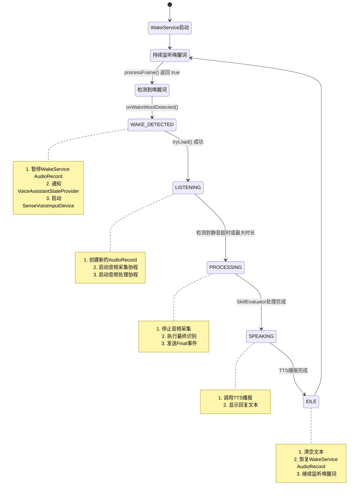

# 语音助手状态转换与Buffer处理完整设计文档

> 版本: 1.0  
> 日期: 2025-10-14  
> 作者: AI Assistant

## 📋 目录

1. [总体架构](#总体架构)
2. [状态转换关系](#状态转换关系)
3. [Buffer处理逻辑](#buffer处理逻辑)
4. [已知问题分析](#已知问题分析)
5. [优化建议](#优化建议)

---

## 1. 总体架构

### 1.1 核心组件关系

```
┌─────────────────────────────────────────────────────────────┐
│                      用户界面层                               │
├─────────────────────────────────────────────────────────────┤
│  DraggableFloatingOrb (悬浮球)                               │
│  ├─ LottieAnimationController (动画控制)                     │
│  ├─ FloatingTextDisplay (文本显示)                           │
│  └─ VoiceAssistantStateProvider (状态提供者)                 │
└─────────────────────────────────────────────────────────────┘
                            ↕ 状态监听
┌─────────────────────────────────────────────────────────────┐
│                     状态协调层                                │
├─────────────────────────────────────────────────────────────┤
│  VoiceAssistantStateCoordinator                              │
│  ├─ 协调WakeService和SenseVoiceInputDevice                   │
│  └─ 管理全局状态转换                                          │
└─────────────────────────────────────────────────────────────┘
                            ↕
┌──────────────────────┬────────────────────────────────────┐
│   唤醒词检测层        │       语音识别层                     │
├──────────────────────┼────────────────────────────────────┤
│  WakeService         │  SenseVoiceInputDevice             │
│  ├─ WakeDevice       │  ├─ SenseVoiceRecognizer          │
│  ├─ AudioRecord (1)  │  ├─ AudioRecord (2)               │
│  └─ VAD (Wake)       │  └─ VAD (ASR)                     │
└──────────────────────┴────────────────────────────────────┘
```

### 1.2 状态枚举定义

#### VoiceAssistantUIState (UI状态)
```kotlin
enum class VoiceAssistantUIState {
    IDLE,              // 空闲
    WAKE_DETECTED,     // 唤醒词检测到
    LISTENING,         // 监听中
    PROCESSING,        // 处理中
    SPEAKING,          // 播报中
    ERROR              // 错误
}
```

#### SttState (语音识别状态)
```kotlin
sealed class SttState {
    object NotInitialized   // 未初始化
    object NotLoaded        // 未加载
    object Idle            // 空闲
    object Listening       // 监听中
    object Processing      // 处理中
}
```

#### WakeState (唤醒词状态)
```kotlin
sealed class WakeState {
    object NotDownloaded           // 未下载
    object NotLoaded              // 未加载
    object Loading                // 加载中
    object Loaded                 // 已加载
    data class ErrorLoading(...)  // 加载错误
}
```

---

## 2. 状态转换关系

### 2.1 正常流程状态转换



### 2.2 超时机制

#### 2.2.1 SenseVoiceInputDevice超时
```kotlin
// 位置: processAudio() 函数

// 1. 最大录制时长 (30秒)
if (elapsed > MAX_RECORDING_DURATION_MS) {
    Log.d(TAG, "⏰ 达到最大录制时间")
    break  // 退出循环，触发最终识别
}

// 2. 静音超时 (6秒)
if (isSpeechDetected && !hasSpeech) {
    val silenceDuration = currentTime - lastSpeechTime
    if (silenceDuration > SPEECH_TIMEOUT_MS) {
        Log.d(TAG, "🔇 检测到静音超时")
        break  // 退出循环，触发最终识别
    }
}
```

#### 2.2.2 WakeService超时恢复
```kotlin
// 位置: onWakeWordDetected() 函数

// STT资源释放超时 (10秒)
handler.postDelayed(resumeWakeServiceRunnable, RELEASE_STT_RESOURCES_MILLIS)

// 超时后执行:
// 1. 释放SenseVoiceInputDevice资源
// 2. 恢复WakeService AudioRecord
// 3. 继续监听唤醒词
```

### 2.3 AudioRecord资源竞争处理

```
时间线：
─────────────────────────────────────────────────────────────

WakeService:    [录音中] ──暂停──> [暂停] ────恢复──> [录音中]
                    ↓                        ↑
SenseVoice:         └──[开始录音]──[识别]──[停止]┘

关键点：
1. 同一时刻只能有一个AudioRecord在录音
2. WakeService必须暂停才能让SenseVoice启动
3. SenseVoice完成后必须恢复WakeService
```

#### 当前实现
```kotlin
// WakeService暂停机制
private fun pauseAudioRecordForASR() {
    audioRecordPaused.set(true)
    // AudioRecord保持打开，但不读取数据
}

// WakeService恢复机制
private fun resumeAudioRecordAfterASR() {
    audioRecordPaused.set(false)
    // 继续读取AudioRecord数据
}
```

---

## 3. Buffer处理逻辑

### 3.1 SenseVoiceInputDevice Buffer处理架构

```
┌─────────────────────────────────────────────────────────┐
│              协程1: recordAudio() [IO]                   │
│                                                          │
│  AudioRecord.read() ──> ShortArray(1600)                │
│         │                                                │
│         └──> 转换为 FloatArray                           │
│                  │                                       │
│                  └──> samplesChannel.send()             │
└─────────────────────────────────────────────────────────┘
                         ↓ Channel传输
┌─────────────────────────────────────────────────────────┐
│            协程2: processAudio() [Default]               │
│                                                          │
│  for (samples in samplesChannel) {                      │
│      1. VAD检测 (512样本/32ms)                          │
│      2. 添加到speechBuffer                              │
│      3. 实时识别 (每200ms)                               │
│      4. 超时检测                                         │
│  }                                                       │
│                                                          │
│  最终识别: speechBuffer.toFloatArray()                   │
└─────────────────────────────────────────────────────────┘
```

### 3.2 详细Buffer流程

#### 3.2.1 音频采集 (recordAudio)
```kotlin
// 1. 读取原始音频
val audioBuffer = ShortArray(1600)  // 100ms @ 16kHz
val bytesRead = audioRecord!!.read(audioBuffer, 0, audioBuffer.size)

// 2. Short转Float归一化
val samples = FloatArray(bytesRead) { i ->
    audioBuffer[i] / 32768.0f  // Int16 -> Float32
}

// 3. 发送到Channel
samplesChannel.send(samples)
```

#### 3.2.2 VAD处理 (processNewSamples)
```kotlin
// 1. 分割为VAD窗口 (512样本/32ms)
for (i in samples.indices step VAD_WINDOW_SIZE) {
    val window = samples.sliceArray(i until min(i + VAD_WINDOW_SIZE, samples.size))
    
    // 2. VAD检测
    vad?.acceptWaveform(window)
    val hasSpeech = vad?.isSpeechDetected() == true
    
    // 3. 状态管理
    if (hasSpeech) {
        if (!isSpeechDetected) {
            isSpeechDetected = true
            speechStartTime = System.currentTimeMillis()
        }
        lastSpeechTime = System.currentTimeMillis()
    }
    
    // 4. 添加到Buffer
    speechBuffer.addAll(window.toList())
}
```

#### 3.2.3 实时识别 (performPartialRecognition)
```kotlin
// 每200ms执行一次
val now = System.currentTimeMillis()
if (now - lastRecognitionTime < RECOGNITION_INTERVAL_MS) {
    return
}

// 1. 获取当前音频数据
val audioData = speechBuffer.toFloatArray()

// 2. 增量识别（只识别新数据）
val text = if (added) {
    // 使用增量缓冲区
    recognizer.recognizeIncremental(audioData)
} else {
    // 首次完整识别
    recognizer.recognize(audioData)
    added = true
    recognizer.recognizeIncremental(FloatArray(0))
}

// 3. 发送Partial事件
eventListener?.invoke(InputEvent.Partial(text))
```

#### 3.2.4 最终识别 (performFinalRecognition)
```kotlin
// 1. 检查有效性
if (speechBuffer.isEmpty() || !isSpeechDetected) {
    eventListener?.invoke(InputEvent.None)
    return
}

// 2. 时长检查
val duration = System.currentTimeMillis() - speechStartTime
if (duration < MIN_SPEECH_DURATION_MS) {
    eventListener?.invoke(InputEvent.None)
    return
}

// 3. 最终识别
val audioData = speechBuffer.toFloatArray()
val text = recognizer.recognize(audioData)

// 4. 发送Final事件
eventListener?.invoke(
    InputEvent.Final(listOf(Pair(text, 1.0f)))
)
```

### 3.3 Buffer内存管理

```kotlin
// Buffer类型
private val speechBuffer = mutableListOf<Float>()

// 预期大小计算
// 最大30秒音频: 16000 * 30 = 480,000 samples
// Float内存: 480,000 * 4 bytes = 1.83 MB

// 清理时机
fun resetRecordingState() {
    speechBuffer.clear()  // 释放内存
    // ... 其他重置
}
```

---

## 4. 已知问题分析

### 4.1 ❌ 问题1: 超时后不返回IDLE状态

**症状**：
```log
09-20 22:20:39.809 D 🎨[DraggableFloatingOrb]: 🎨 UI state updated: LISTENING
09-20 22:20:44.028 V SenseVoiceInputDevice: 📊 音频数据#250 (还在采集)
// 超时后没有转换到IDLE
```

**原因分析**：
1. `SenseVoiceInputDevice.stopListening()` 只设置 `isRecording.set(false)`
2. 没有显式发送 `InputEvent.None` 或触发状态更新
3. `VoiceAssistantStateProvider` 没有收到状态变化通知

**修复方案**：
```kotlin
// 在 performFinalRecognition() 后添加
withContext(Dispatchers.Main) {
    _uiState.value = SttState.Idle
}
```

### 4.2 ❌ 问题2: 超时结束后立即变为LISTENING

**症状**：
```log
// 超时后
IDLE → LISTENING (立即触发)
```

**原因分析**：
1. WakeService的 `resumeWakeServiceRunnable` 在10秒后恢复AudioRecord
2. 但SenseVoiceInputDevice可能在超时（6秒）后就结束了
3. 存在4秒的时间差，可能触发意外的状态转换

**修复方案**：
```kotlin
// 在 SenseVoiceInputDevice.performFinalRecognition() 中
// 立即通知WakeService恢复
WakeWordCallbackManager.notifyAsrCompleted()
```

### 4.3 ❌ 问题3: AudioRecord资源竞争

**症状**：
```log
⚠️ 已在录制中
```

**原因分析**：
1. WakeService的AudioRecord可能没有完全暂停
2. SenseVoiceInputDevice尝试创建新AudioRecord失败

**修复方案**：
```kotlin
// 确保WakeService真正停止AudioRecord
private fun pauseAudioRecordForASR() {
    audioRecordPaused.set(true)
    currentAudioRecord?.let {
        if (it.recordingState == AudioRecord.RECORDSTATE_RECORDING) {
            it.stop()  // 真正停止
        }
    }
}
```

### 4.4 ❌ 问题4: 状态不一致

**症状**：
```log
D 🎨[DraggableFloatingOrb]: 🎯 Skill result: 错误 - 未能理解您的请求
// 但UI显示LISTENING
```

**原因分析**：
1. Skill结果和UI状态更新不同步
2. 可能存在多个状态更新路径

---

## 5. 优化建议

### 5.1 🎯 核心优化：状态机模式

**当前问题**：
- 状态转换逻辑分散在多个组件
- 缺乏统一的状态管理
- 难以追踪状态转换路径

**建议方案**：
```kotlin
sealed class VoiceAssistantEvent {
    object WakeWordDetected
    object AsrStarted
    object AsrPartialResult
    object AsrFinalResult
    object AsrTimeout
    object AsrError
    object SkillProcessing
    object TtsSpeaking
    object TtsCompleted
}

class VoiceAssistantStateMachine {
    private var currentState: VoiceAssistantUIState = IDLE
    
    fun handleEvent(event: VoiceAssistantEvent) {
        val newState = when (currentState to event) {
            IDLE to WakeWordDetected -> WAKE_DETECTED
            WAKE_DETECTED to AsrStarted -> LISTENING
            LISTENING to AsrTimeout -> PROCESSING
            // ... 定义所有合法转换
            else -> {
                Log.e(TAG, "非法状态转换: $currentState -> $event")
                currentState  // 保持不变
            }
        }
        
        if (newState != currentState) {
            onStateChanged(currentState, newState)
            currentState = newState
        }
    }
}
```

### 5.2 🔧 超时管理优化

```kotlin
class TimeoutManager {
    private val handler = Handler(Looper.getMainLooper())
    private val timeouts = mutableMapOf<String, Runnable>()
    
    fun setTimeout(name: String, delayMs: Long, action: () -> Unit) {
        cancel(name)
        val runnable = Runnable { action() }
        timeouts[name] = runnable
        handler.postDelayed(runnable, delayMs)
    }
    
    fun cancel(name: String) {
        timeouts[name]?.let {
            handler.removeCallbacks(it)
            timeouts.remove(name)
        }
    }
    
    fun cancelAll() {
        timeouts.forEach { (_, runnable) ->
            handler.removeCallbacks(runnable)
        }
        timeouts.clear()
    }
}

// 使用示例
timeoutManager.setTimeout("asr_timeout", 6000) {
    handleAsrTimeout()
}
```

### 5.3 🎭 AudioRecord资源池

```kotlin
object AudioRecordPool {
    private var currentOwner: String? = null
    private var audioRecord: AudioRecord? = null
    
    fun acquire(owner: String, config: AudioConfig): AudioRecord? {
        release(currentOwner)
        
        audioRecord = AudioRecord(
            config.source,
            config.sampleRate,
            config.channelConfig,
            config.audioFormat,
            config.bufferSize
        )
        currentOwner = owner
        
        return audioRecord
    }
    
    fun release(owner: String?) {
        if (currentOwner == owner) {
            audioRecord?.let {
                if (it.recordingState == AudioRecord.RECORDSTATE_RECORDING) {
                    it.stop()
                }
                it.release()
            }
            audioRecord = null
            currentOwner = null
        }
    }
}
```

### 5.4 📊 状态监控与调试

```kotlin
class StateMonitor {
    data class StateTransition(
        val timestamp: Long,
        val fromState: VoiceAssistantUIState,
        val toState: VoiceAssistantUIState,
        val trigger: String
    )
    
    private val history = mutableListOf<StateTransition>()
    
    fun recordTransition(from: VoiceAssistantUIState, 
                        to: VoiceAssistantUIState,
                        trigger: String) {
        val transition = StateTransition(
            System.currentTimeMillis(),
            from,
            to,
            trigger
        )
        history.add(transition)
        
        // 保留最近100条
        if (history.size > 100) {
            history.removeAt(0)
        }
        
        Log.d(TAG, "状态转换: $from → $to (触发: $trigger)")
    }
    
    fun dumpHistory(): String {
        return history.joinToString("\n") {
            "${it.timestamp}: ${it.fromState} → ${it.toState} (${it.trigger})"
        }
    }
}
```

---

## 6. 实施计划

### Phase 1: 问题修复（优先级：🔴高）
- [ ] 修复超时后不返回IDLE状态
- [ ] 修复AudioRecord资源竞争
- [ ] 修复状态不一致问题

### Phase 2: 架构重构（优先级：🟡中）
- [ ] 实现状态机模式
- [ ] 统一超时管理
- [ ] AudioRecord资源池

### Phase 3: 监控增强（优先级：🟢低）
- [ ] 状态转换监控
- [ ] 性能指标收集
- [ ] 错误追踪系统

---

## 附录

### A. 关键常量配置

```kotlin
// SenseVoiceInputDevice
SAMPLE_RATE = 16000                  // 采样率
VAD_WINDOW_SIZE = 512                // VAD窗口 (32ms)
RECOGNITION_INTERVAL_MS = 200L       // 识别间隔
SPEECH_TIMEOUT_MS = 6000L            // 静音超时
MAX_RECORDING_DURATION_MS = 30000L   // 最大录制时长

// WakeService
RELEASE_STT_RESOURCES_MILLIS = 10000L  // STT资源释放超时
WAKE_WORD_BACKOFF_MILLIS = 2000L       // 唤醒词退避时间
```

### B. 调试技巧

#### 打印完整状态
```kotlin
fun dumpState() {
    Log.d(TAG, """
        ===== 状态快照 =====
        UI状态: ${voiceAssistantState}
        STT状态: ${sttState}
        Wake状态: ${wakeState}
        AudioRecord(Wake): ${wakeAudioRecordState}
        AudioRecord(ASR): ${asrAudioRecordState}
        Buffer大小: ${speechBuffer.size}
        录音时长: ${recordingDuration}ms
        ===================
    """.trimIndent())
}
```

#### 过滤日志
```bash
# 只看状态转换
adb logcat | grep "State updated"

# 只看超时
adb logcat | grep "超时\|timeout"

# 只看AudioRecord
adb logcat | grep "AudioRecord"
```

---

**文档结束**

